# MuSR: MULTI-SCALE 3D SCENES RECONSTRUCTION BASED ON MONOCULAR VIDEO
<html>
	<head>
		
	</head>

	<body>
 		<!-- Qualitative results for reconstruction efficiency on a real-world scene -->
   		 
		<section> 			
  			
 
     				
 				
	 				
 					
      						<h2>Qualitative results for reconstruction efficiency on a real-world scene</h2> 											
 					
	    					  																				
 																				

     				
 					
	 				
 						
      						<h3>Scene 1</h3>       											
	  				
 				
       				
 				
		   		
 					
	      				
 																			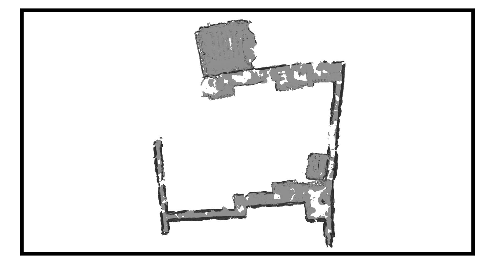 					
		  			
 					
	      				
 																			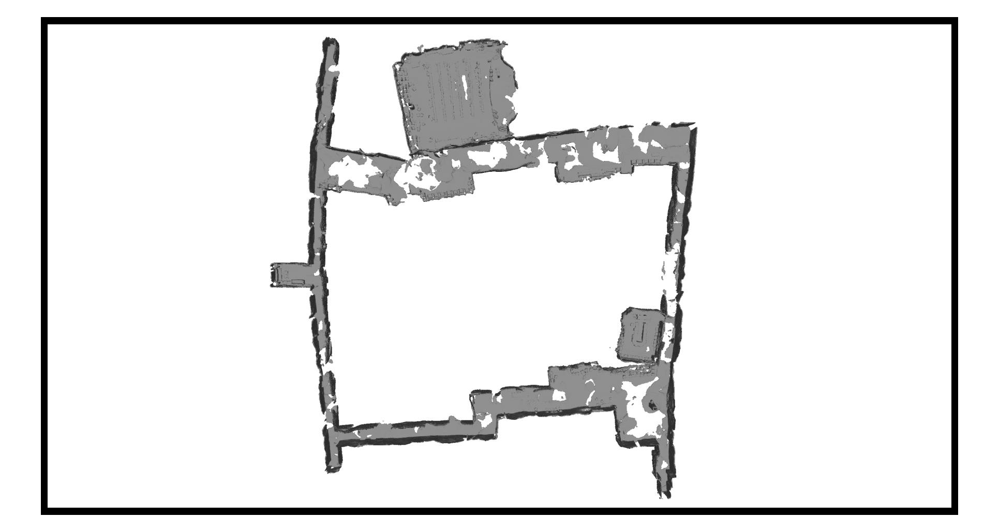 												
 								
	       			
     				
		  		
 					
	     				
 						
		 				
 (a) NeuralRecon 
 					
	     				
 					
		 			
											 								
 (b) MuSR 
								 						
																				
	

	      			 
	
	    			 
 					 	 														
 						       												<h3>Scene 2</h3> 					 	  												
 				        															
 	
	      			

		  			
 																			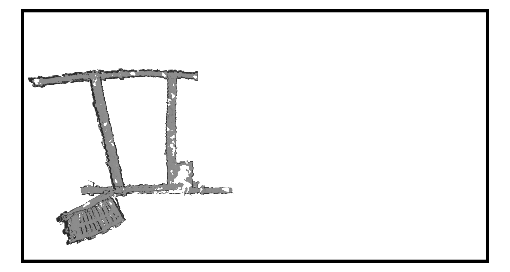 					 		  					

	       				
 																			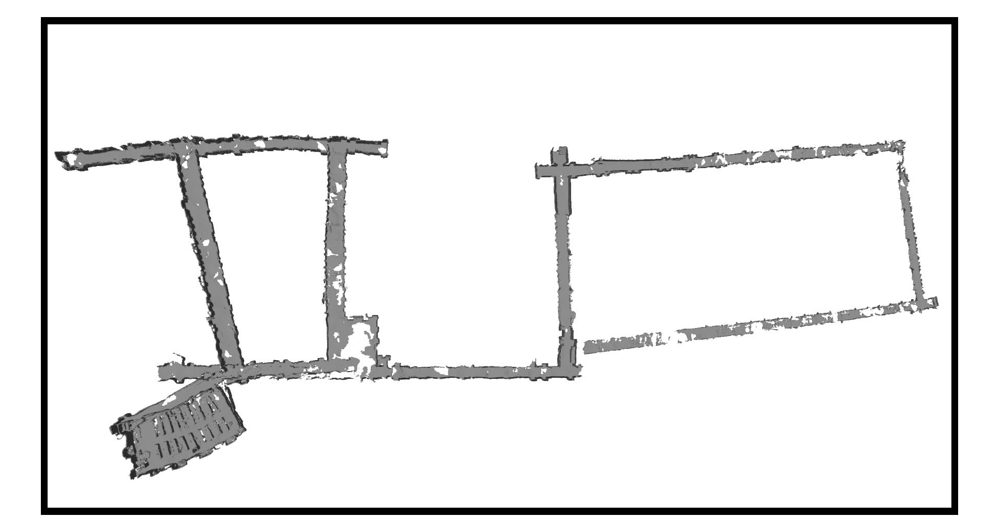 												
							 								 	       				
  
		    		

					

	     					
 (a) NeuralRecon 
 					 	     							
 	 		 			
		         		
											 								
 (b) MuSR 
								 						
																				
	
      			
 		
		</section>   		
  		 
    		 

    		<!-- GPU memory statistics -->    				
      		 
		<section>
  			
 
     				

	 				
 					       						
  						<h2>GPU memory statistics</h2> 					
  						
 					 	    					
  						  	
  					

  				

				

					

						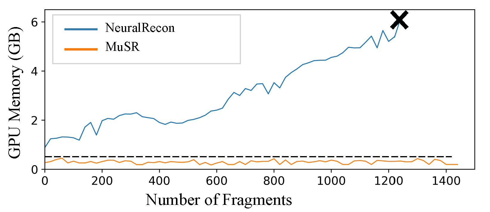
					

					

						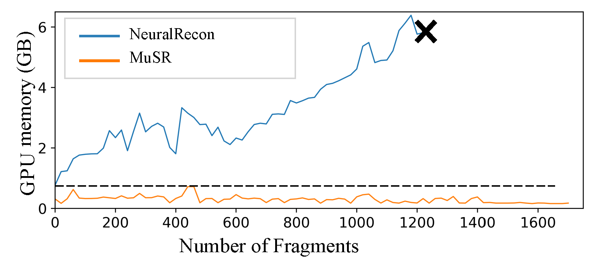
					

				

				

					

						
 Scene 1 

					

					

						
 Scene 2 

					

				

    			

		</section>
  		 
    		 

        	<!-- Time statistics -->
	 	 

      		<section>
			

   				
 	 			
       					
 					       						   							<h2>Time statistics</h2> 					   													
 					 	    					   							  	   																			

	    			

				

					

						
					

					

						
					

				

				

					

						
Scene 1 

					

					

						
Scene 2

					

				

			

		</section>

  		 
    		 
    
  		<section>
			

				

					

						<h2>Qualitative results for quality of local details on realworld scenes</h2>
      						

						 
					

				

				

					

						
					

					

						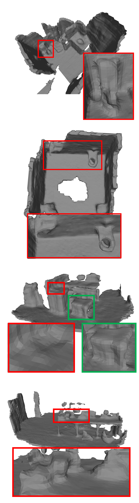
					

					

						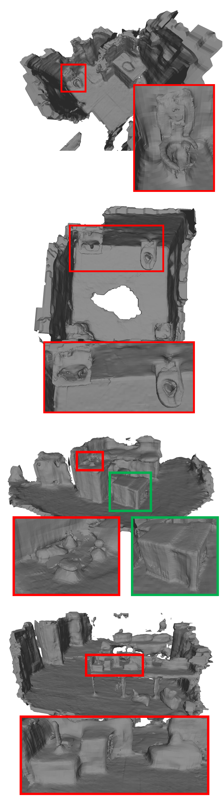
					

				

    				

					

						
 (a) GT / real scene 

					

					

						
 (b) NeuralRecon 

					

					

						
 (c) Ours 

					

				

			

		</section>
  		 
		<section>
			

				

					

						<h2>Qualitative results for quality of global completeness on real-world scenes</h2>
      						

						 
					

				

				

					

						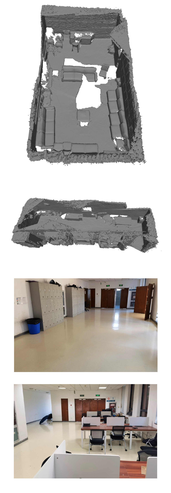
					

					

						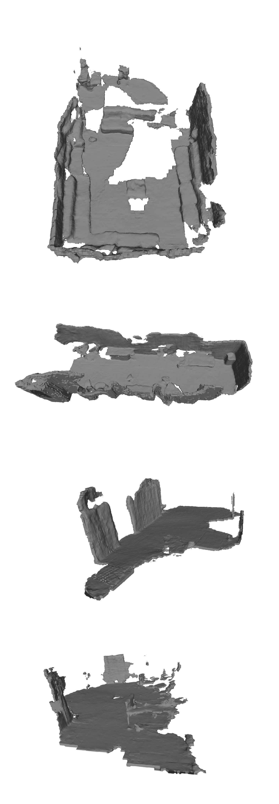
					

					

						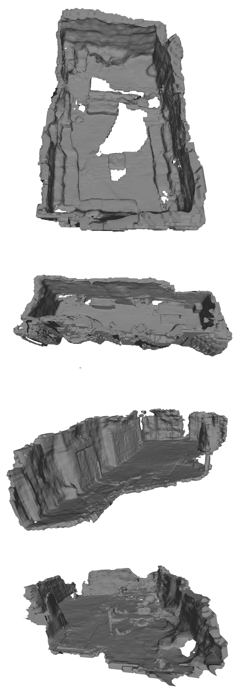
					

				

    				

					

						
 (a) GT / real scene 

					

					

						
 (b) NeuralRecon 

					

					

						
 (c) Ours 

					

				

			

		</section>
	</body>
</html>
